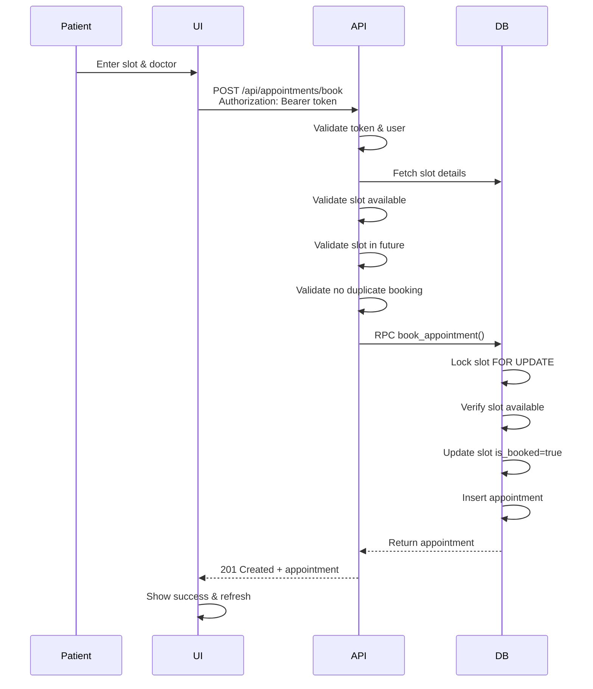
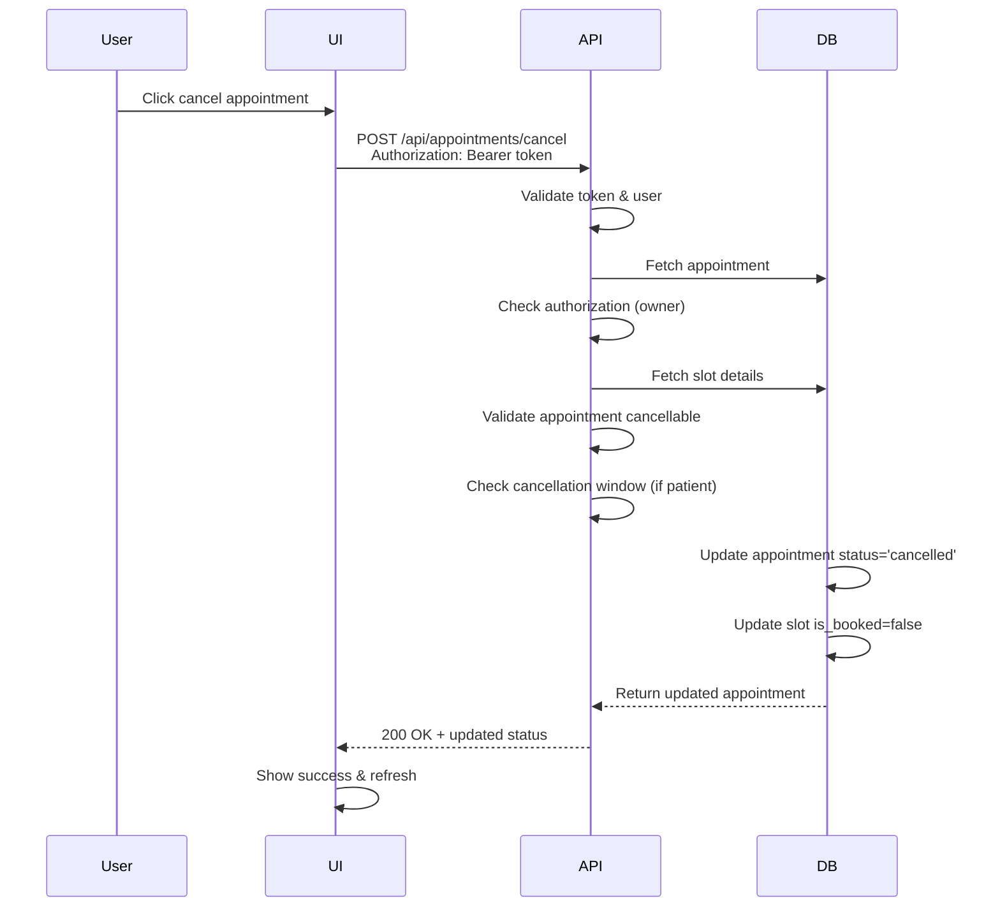
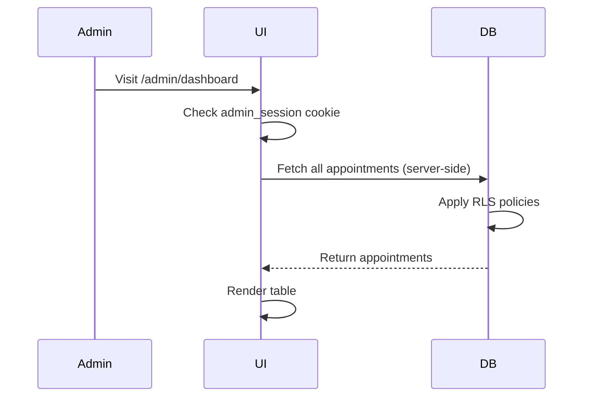

# Appointment Booking System

A full-stack appointment booking platform built with Next.js, TypeScript, and Supabase with comprehensive testing and role-based access control.

---

## Table of Contents

- [Quick Start](#quick-start)
- [Architecture](#architecture)
- [API Endpoints](#api-endpoints)
- [Workflows](#workflows)
- [Database Schema](#database-schema)
- [Testing](#testing)
- [Credentials](#test-credentials)

---

## Quick Start

### 1. Setup Supabase

Go to [supabase.com](https://supabase.com), sign in, and create a new project. Once ready:

- Go to **SQL Editor**
- Click **"+ New Query"**
- Paste contents of `schema.sql`
- Click **Run**

### 2. Configure Environment

Place the `.env` file in the root directory:

```bash
NEXT_PUBLIC_SUPABASE_URL=your_supabase_url
NEXT_PUBLIC_SUPABASE_ANON_KEY=your_anon_key
SUPABASE_SERVICE_ROLE_KEY=your_service_role_key
```

### 3. Install & Seed

```bash
npm install
npm run seed          # Creates users, admin, slots, and sample appointment
npm run dev           # Start dev server
```

Open [http://localhost:3000](http://localhost:3000)

### 4. Run Tests

```bash
npm test              # Run all tests
npm run test:unit     # Unit tests only
npm run test:integration # Integration tests only
```

---

## Architecture

### System Components

```
┌─────────────────────────────────────────────────────────────┐
│                        Next.js Frontend                      │
├──────────────────┬──────────────────┬──────────────────────┤
│  Patient Login   │  Doctor Login    │  Admin Login         │
│  Book/Cancel     │  Mark Done       │  View All Appts      │
└──────────────────┴──────────────────┴──────────────────────┘
           │                │                    │
           ├────────────────┼────────────────────┤
           ▼                ▼                    ▼
    ┌────────────────────────────────────────────────────┐
    │              API Routes (Next.js)                   │
    ├────────────────────────────────────────────────────┤
    │ POST /api/appointments/book                         │
    │ POST /api/appointments/cancel                       │
    │ POST /api/admin/login                              │
    └────────────────────────────────────────────────────┘
                     │
                     ▼
    ┌────────────────────────────────────────────────────┐
    │         Supabase (PostgreSQL + Auth)               │
    ├────────────────────────────────────────────────────┤
    │ • Row-Level Security (RLS) Policies                │
    │ • RPC Functions with SECURITY DEFINER              │
    │ • Database Constraints & Indexes                   │
    └────────────────────────────────────────────────────┘
```

### Security Layers

1. **Authentication**: Supabase Auth (JWT tokens)
2. **Authorization**: Bearer tokens + role-based checks
3. **Database**: RLS policies + RPC functions with SECURITY DEFINER
4. **Sessions**: httpOnly cookies (24-hour expiry, sameSite="lax")

---

## API Endpoints

| Method | Endpoint | Authentication | Description |
| :--- | :--- | :--- | :--- |
| `POST` | `/api/admin/login` | None | Authenticates system admin and sets session cookie. |
| `POST` | `/api/appointments/book` | Bearer Token | Books an appointment for a patient. |
| `POST` | `/api/appointments/cancel` | Bearer Token | Cancels or completes an appointment. |


### 1. Book Appointment

**POST** `/api/appointments/book`

**Authentication**: Bearer Token (Required)

**Request Body**:

```json
{
  "slotId": "uuid",
  "doctorId": "uuid"
}
```

**Response** (201 Created):

```json
{
  "id": "uuid",
  "patient_id": "uuid",
  "doctor_id": "uuid",
  "slot_id": "uuid",
  "status": "active",
  "created_at": "2026-04-29T10:00:00Z"
}
```

**Error Responses**:

- `401 Unauthorized` - Missing or invalid token
- `400 Bad Request` - Missing slotId or doctorId
- `404 Not Found` - Slot not found
- `409 Conflict` - Slot already booked, invalid doctor, slot in past, or duplicate active appointment

**Business Rules**:

- Slot must be available (is_booked = false)
- Slot must be in the future
- Slot must belong to selected doctor
- Patient cannot have another active appointment with same doctor
- All validated before database operation

---

### 2. Cancel/Done Appointment

**POST** `/api/appointments/cancel`

**Authentication**: Bearer Token (Required)

**Request Body**:

```json
{
  "appointmentId": "uuid",
  "action": "cancel" | "done"
}
```

**Response** (200 OK):

```json
{
  "id": "uuid",
  "patient_id": "uuid",
  "doctor_id": "uuid",
  "slot_id": "uuid",
  "status": "cancelled" | "done",
  "created_at": "2026-04-29T10:00:00Z"
}
```


**Business Rules**:

- Patient can cancel anytime (except within 1 hour of start)
- Doctor can cancel/mark done anytime
- Cannot cancel already done/cancelled appointments
- Slot marked as available (is_booked = false) on cancellation
- Only doctors can mark appointments as "done"

**Role-Based Access**:
| Role | Can Cancel | Can Mark Done | 1-Hour Rule |
|------|-----------|---------------|------------|
| Patient | Yes (>1hr) | No | Yes |
| Doctor | Yes | Yes | No |

---

### 3. Admin Login

**POST** `/api/admin/login`

**Authentication**: None (Public)

**Request Body**:

```json
{
  "email": "admin@test.com",
  "password": "admin123"
}
```

**Response** (200 OK):

```json
{
  "success": true
}
```

Sets `admin_session` cookie: `admin_<adminId>` (httpOnly, 24-hour expiry)

**Error Responses**:

- `400 Bad Request` - Missing email or password
- `401 Unauthorized` - Invalid credentials

---

## Workflows

### Booking Flow



### Cancellation Flow



### Admin Dashboard Flow



---

---

## Test Credentials

| Role      | Email             | Password   |
| --------- | ----------------- | ---------- |
| Doctor 1  | doctor1@test.com  | doctor123  |
| Doctor 2  | doctor2@test.com  | doctor123  |
| Doctor 3  | doctor3@test.com  | doctor123  |
| Patient 1 | patient1@test.com | patient123 |
| Patient 2 | patient2@test.com | patient123 |
| Patient 3 | patient3@test.com | patient123 |
| Admin     | admin@test.com    | admin123   |

---

## Project Structure

```
├── app/
│   ├── api/
│   │   ├── admin/login/          # Admin authentication
│   │   └── appointments/
│   │       ├── book/             # Booking endpoint
│   │       └── cancel/           # Cancellation endpoint
│   ├── admin/
│   │   ├── dashboard/            # Admin dashboard (SSR)
│   │   └── login/                # Admin login page
│   ├── doctor/dashboard/         # Doctor portal
│   ├── patient/dashboard/        # Patient portal
│   └── layout.tsx
├── lib/
│   ├── supabase.ts               # Client Supabase
│   ├── supabaseAdmin.ts          # Admin Supabase
│   └── validators.ts             # Business logic
├── tests/
│   ├── unit/validators.test.ts
│   ├── integration/
│   │   ├── booking.test.ts
│   │   ├── cancellation.test.ts
│   │   └── guards.test.ts
├── schema.sql                    # Database schema
└── seed.mjs                      # Database seeding

```

---

## Security Considerations

### Implemented

- **Token Validation** - All API routes verify JWT tokens
- **Role-Based Access** - Different rules for patient/doctor/admin
- **SQL Injection Prevention** - Using RPC functions & parameterized queries
- **Password Security** - bcrypt hashing (admin passwords)
